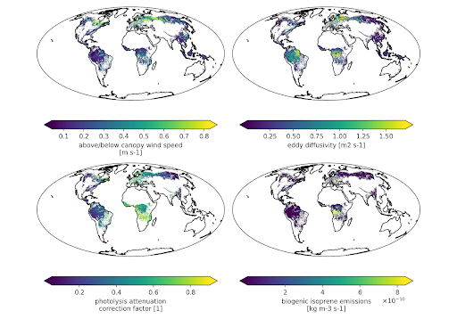

<h1>
  <a href="https://github.com/noaa-oar-arl/canopy-app">
    
  </a>
</h1>

[](https://github.com/noaa-oar-arl/canopy-app/blob/main/LICENSE)
[](https://github.com/noaa-oar-arl/canopy-app/actions/workflows/ci.yml)
[](https://doi.org/10.5281/zenodo.8403649)

Repository for low-level, stand-alone/column canopy parameterizations for testing and application to gridded atmospheric composition/air quality models.

Authors: Patrick Campbell, Zachary Moon, and Wei-Ting Hung

## Getting Started

### Build

Canopy-App requires NetCDF-Fortran Libraries (i.e., `-lnetcdf -lnetcdff`) when using the 1D/2D NetCDF I/O Option (i.e., `infmt_opt=0`).
See [the included Makefile](./src/Makefile), which detects NetCDF using `nf-config`, for an example (on GMU Hopper, you can use the `netcdf-c/4.7.4-vh` and `netcdf-fortran/4.5.3-ff` modules).

Compilation options can be controlled with environment variables:

- `FC=gfortran` (default) or compiler name/path (e.g. `FC=ifort`, `FC=gfortran-11`, `FC=/usr/bin/gfortran-11`)
- `DEBUG=0` (off; default) or `DEBUG=1` (on) or `DEBUG=2` (more flags, including FPE traps and traceback)
- `NC=0` (off) or `NC=1` (on; default)

Example:
a) with compiler set by `FC` environment variable (falling back to `gfortran` if unset), Debug flags ON and with NetCDF:
```
DEBUG=1 NC=1 make -C src
```
Note: Not supplying `FC` doesn't necessarily give `gfortran`, since `FC` might already be set in the environment (for example, `module load` situations may do this). In such case do:
```
DEBUG=1 NC=1 FC=gfortran make -C src
```
b) with Intel Fortran (`ifort`), Debug flags ON and with NetCDF:
```
DEBUG=1 NC=1 FC=ifort make -C src
```

### Modify settings

If necessary, modify [the settings](#table-3-current-user-namelist-options) in the Fortran namelist file [`input/namelist.canopy`](./input/namelist.canopy),
which is read at runtime.

### Run

```
./canopy
```

You can also [generate global inputs and run with Python](./python/README.md).

## Components

Current Canopy-App components:

1.  In-Canopy Winds and Wind Adjustment Factor (WAF) for wildfire spread and air quality applications.  Based on Massman et al. (2017).

    Namelist Option : `ifcanwind` and/or `ifcanwaf` Output Variables: `ws` (m s-1) `waf` (fraction)

    - `canopy_wind_mod.F90`
    - `canopy_waf_mod.F90`

2.  In-Canopy vertical diffusion (i.e., eddy diffusivities used to scale resolved model layer 1 diffusion).  Based on Massman et al. (2017) and Makar et al. (2017).

    Namelist Option : `ifcaneddy`  Output Variables:  `kz` (m2 s-1)

    - `canopy_eddyx_mod.F90`

3.  In-Canopy photolysis attenuation (i.e., used to scale resolved model layer 1 photolysis).  Based on Massman et al. (2017) and Markar et al. (2017).  

    Namelist Option : `ifcanphot`  Output Variables: `rjcf` (fraction)

    - `canopy_phot_mod.F90`

4.  In-Canopy leaf-level biogenic emissions (kg m-3 s-1). Based on MEGANv2 and v3 (Guenther et al., 2012), and using both Clifton et al. (2021) and Silva et al. (2020) parameterizations.

    - Note the emissions here are at leaf-level and the units are in per m3 (in each canopy layer volume using the LAD/biomass distribution) for the respective vegetation type in each grid cell/point. This is different then MEGANv2 or v3, as such models approximate combined activity factors per canopy level, sum them weighted to a given biomass distribution, and use total LAI to calculate the "big-leaf" 2D flux of biogenic emissions to the overlying atmosphere.  Thus, to get 2D total flux of biogenic emissions per m2 from Canopy-App, the explicit leaf-level emissions profile must be integrated across the individual canopy layer depths/resolutions (i.e., "modres", see [Table 3](#table-3-current-user-namelist-options)).  Since the modres is constant in Canopy-App, the layers can be directly summed and then multiplied by modres to get kg m-2 s-1. This sum neglects any effects of time integrated losses and/or chemistry that would reduce total biogenic emissions flux from the canopy.  When fractional vtypes (i.e., land use) are used, the summed layers can be multiplied by the fractional grid box areal coverage for each vegetation types in the grid cell.  However, for the current dominant vtype approach as input to Canopy-App and many UFS applications this multiplicative fraction = 1.

    Namelist Option : `ifcanbio`   Output Variables: see [Table 1](#table-1-canopy-app-biogenic-emissions-output-variables) below

    - `canopy_bioemi_mod.F90`

## Outputs

**Note for Biogenic emissions:** When `ifcanbio=.TRUE.`, output will include 3D canopy resolved biogenic emissions for the following species (based on Guenther et al., 2012), which have been mapped from Guenther et al. PFTs to input LU_OPT.

### Table 1. Canopy-App Biogenic Emissions Output Variables

| Variable Name | Variable Description (Units: kg m-3 s-1)  |
| ------------- | ----------------------------------------- |
| `emi_isop`    | Isoprene                                  |
| `emi_myrc`    | Myrcene                                   |
| `emi_sabi`    | Sabinene                                  |
| `emi_limo`    | Limonene                                  |
| `emi_care`    | 3-Carene                                  |
| `emi_ocim`    | t-beta-Ocimene                            |
| `emi_bpin`    | beta-Pinene                               |
| `emi_apin`    | alpha-Pinene                              |
| `emi_mono`    | Other Monoterpenes (34 compounds, Table 1 Guenther et al. (2012) |
| `emi_farn`    | alpha-Farnesene                           |
| `emi_cary`    | beta-Caryophyllene                        |
| `emi_sesq`    | Other Sesquiterpene (30 compounds, Table 1 Guenther et al. (2012) |
| `emi_mbol`    | 232-MBO emissions                         |
| `emi_meth`    | Methanol emissions                        |
| `emi_acet`    | Acetone emissions                         |
| `emi_co`      | Carbon Monoxide emissions                 |
| `emi_bvoc`    | Bi-Directional VOC emissions (5 compounds, Table 1 Guenther et al. (2012) |
| `emi_svoc`    | Stress VOC emissions (15 compounds, Table 1 Guenther et al. (2012) |
| `emi_ovoc`    | Other VOC emissions (49 compounds, Table 1 Guenther et al. (2012) |

**Current Canopy-App Output:** As discussed above, the current Canopy-App optional outputs includes 3D canopy winds (`canwind`), canopy vertical/eddy diffusivity values `kz`), biogenic emissions (see Table 1), and
canopy photolysis attenuation correction factors (`rjcf`), and derived Leaf Area Density (`lad`) from the foliage shape function.  Current 2D fields includes the Wind Adjustment Factor (`waf`), flame heights (`flameh`), and canopy heights (`canheight`). Current 1D fields include the canopy model interface levels (`z`).

Namelist Option : `file_out`  Prefix string (e.g., `'test'`) used to name output file (Output is 1D txt when using input 1D data (i.e., `infmt_opt=1`), or is 2D NetCDF output when 2D NetCDF input is used (i.e., `infmt_opt=0`)).

## Inputs and Settings

**Current Canopy-App Input:** Typical 1D or 2D (time=1,lat,lon) gridded atmospheric model input variables in 1st layer above canopy.  Some 3D inputs are supported (see `var3d_opt` in [Table 3](#table-3-current-user-namelist-options) and associated options).

Namelist Option : `file_vars`  Full name of input file (Supports either text or NetCDF format with following formats: `.txt`, `.nc`, `.ncf`, or `.nc4`)

- See example file inputs for variables and format (`gfs.t12z.20220701.sfcf000.canopy.txt` or `gfs.t12z.20220701.sfcf000.canopy.nc`).  Example surface met/land/soil inputs are based on NOAA's UFS-GFSv16 inputs initialized on July 01, 2022 @ 12 UTC (forecast at hour 000). Other external inputs for canopy related and other calculated variables are from numerous sources.  See [Table 2](#table-2-canopy-app-required-input-variables) below for more information.  **Note:** The example GFSv16 domain has been cut to the southeast U.S. region only in this example for size/time constraints here.
- Canopy-App assumes the NetCDF input files are in CF-Convention and test file is based on UFS-GFSv16; recommend using double or float for real variables.  Input data must be valid values.
- Canopy-App can also be run with a single point of 1D input data in a text file (e.g. `point_file_20220701.sfcf000.txt`).

The Canopy-App input data in [Table 2](#table-2-canopy-app-required-input-variables) below is based around NOAA's UFS operational Global Forecast System Version 16 (GFSv16) gridded met data, and is supplemented with external canopy data (from numerous sources) and other external and calculated input variables.  

### Table 2. Canopy-App Required Input Variables

| **GFS /Met/Land/Soil Variables** | **Variable Description and Units**          | **Example Data Sources/References (if necessary)** |
| -------------------------------- | ------------------------------------------- | -------------------------------------------------- |
| `lat`                            | Latitude  (degrees)                         | N/A                                                |
| `lon`                            | Longitude (degrees; from 0-360)             | N/A                                                |
| `time`                           | Timestamp (days since YYYY-N-D 0:0:0) (NetCDF Only) | N/A                                        |
| `ugrd10m`                        | U wind at reference height above canopy (m/s), e.g., 10 m | UFS NOAA/GFSv16 *(see below for downloading using AWS) |
| `vgrd10m`                        | V wind at reference height above canopy  (m/s), e.g., 10 m | UFS NOAA/GFSv16                     |
| `vtype`                          | Vegetation type (dimensionless), VIIRS or MODIS | UFS NOAA/GFSv16                                |
| `fricv`                          | Friction velocity (m/s)                     | UFS NOAA/GFSv16                                    |
| `sfcr`                           | Total surface roughness length (m)          | UFS NOAA/GFSv16                                    |
| `sotyp`                          | Soil type (dimensionless), STATSGO          | UFS NOAA/GFSv16                                    |
| `pressfc`                        | Surface pressure (Pa)                       | UFS NOAA/GFSv16                                    |
| `dswrf`                          | Instantaneous downward shortwave radiation at surface (W/m2) | UFS NOAA/GFSv16                   |
| `shtfl`                          | Instantaneous sensible heat flux at surface (W/m2) | UFS NOAA/GFSv16                             |
| `tmpsfc`                         | Surface temperature (K)                     | UFS NOAA/GFSv16                                    |
| `tmp2m`                          | 2-meter temperature (K)                     | UFS NOAA/GFSv16                                    |
| `spfh2m`                         | 2-meter specific humidity (kg/kg)           | UFS NOAA/GFSv16                                    |
| `hpbl`                           | Height of the planetary boundary layer (m)  | UFS NOAA/GFSv16                                    |
| `prate_ave`                      | Average mass precipitation rate (kg m-2 s-1) | UFS NOAA/GFSv16                                   |
| `soilw1`                         | Volumetric soil moisture in layer 1 (m3 m-3) | UFS NOAA/GFSv16                                   |
| `soilw2`                         | Volumetric soil moisture in layer 2 (m3 m-3) | UFS NOAA/GFSv16                                   |
| `soilw3`                         | Volumetric soil moisture in layer 3 (m3 m-3) | UFS NOAA/GFSv16                                   |
| `soilw4`                         | Volumetric soil moisture in layer 4 (m3 m-3) | UFS NOAA/GFSv16                                   |
| `wilt`                           | Wilting point (proportion)                  | UFS NOAA/GFSv16                                    |
| **External Canopy Variables**    | **Variable Description and Units**          | **Data Source/Reference (if necessary)**           |
| `ch`                             | Canopy height (m)                    | Globally extended GEDI data. Data Period=2020. Data frequency=Annual. ([Lang et al., 2023](https://doi.org/10.1038/s41559-023-02206-6)) |
| `clu`                            | Canopy clumping index (dimensionless)       | GriddingMachine/MODIS. Data Period=2001-2017 Climatology. Data frequency=Monthly. ([Wei et al., 2019](https://doi.org/10.1016/j.rse.2019.111296)). Extended globally for high latitudes using methods described [here](https://gmuedu-my.sharepoint.com/:w:/g/personal/whung_gmu_edu/EdglXmW2kzBDtDj1xV0alGcB1Yo2I8hzdyWGVGB2YOTfgw). |
| `lai`                            | Leaf area index (m2/m2)                     | VIIRS-NPP. Data Period=2020. Data frequency=Daily, interpolated from original 8-day product. ([Myneni 2018](https://doi.org/10.5067/VIIRS/VNP15A2H.001)). Extended globally for high latitudes using methods described [here](https://gmuedu-my.sharepoint.com/:w:/g/personal/whung_gmu_edu/EdglXmW2kzBDtDj1xV0alGcB1Yo2I8hzdyWGVGB2YOTfgw). |
| `canfrac`                          | Canopy fraction (dimensionless)             | Based on [MODIS VCF](https://doi.org/10.5067/MODIS/MOD44B.061). Data Period=2020. Data frequency=Annual. Extended globally for high latitudes using methods described [here](https://gmuedu-my.sharepoint.com/:w:/g/personal/whung_gmu_edu/EdglXmW2kzBDtDj1xV0alGcB1Yo2I8hzdyWGVGB2YOTfgw). |
| `pavd`                           | Plant area volume density (m2/m3)           | [GEDI product from North Arizona University](https://goetzlab.rc.nau.edu/index.php/gedi/). Data Period=201904-202212 Climatology. Data frequency=Annual. Three dimensional structure of plant area volume density with 14 vertical layers from the surface (0 m) to 70 m above ground level. Data at each layer represents the average pavd within certain height range (e.g. 0 - 5 m for first layer). |
| `lev`                            | Height AGL for levels associated with optional pavd (or other canopy profile) inputs (m)                                  | Same as for GEDI PAVD (or other canopy profile inputs) above                                    |
| **Other External Variables**     | **Variable Description and Units**          | **Data Source/Reference (if necessary)**           |
| `frp`                            | Total Fire Radiative Power (MW/grid cell area) | [NOAA/NESDIS GBBEPx](https://www.ospo.noaa.gov/Products/land/gbbepx/) |
| `csz`                            | Cosine of the solar zenith angle (dimensionless) | [Based on Python Pysolar](https://pysolar.readthedocs.io/en/latest/) |
| `mol`                            | Monin-Obukhov Length (m)                    | Externally calculated using GFS `tmp2m`, `fricv`, and `shtfl`.  ([Essa, 1999](https://inis.iaea.org/collection/NCLCollectionStore/_Public/37/118/37118528.pdf)) |
| `href`                           | Reference height above canopy (m) - 10 m    | Assumed constant (i.e., 10 m).  Can be taken from NL. |

**More Information on Data Sources from [Table 2](#table-2-canopy-app-required-input-variables):**

**Downloading GFS Files from AWS:** NOAA's hourly global GFS, gridded (at ~13x13 km resolution) data may be downloaded publicly from the following Amazon Web Service (AWS) S3 location:
```
https://nacc-in-the-cloud.s3.amazonaws.com/inputs/YYYYMMDD/gfs.t12z.sfcfHHH.nc
```
Where HHH pertains to the hour of the 24-hr forecast (e.g., f000 is initialization).  
Example download command using wget:
```
wget --no-check-certificate --no-proxy https://nacc-in-the-cloud.s3.amazonaws.com/inputs/20230215/gfs.t12z.sfcf000.nc
```
Hourly gridded GFSv16 data is available on AWS from March 23, 2021 - Current Day.

**GriddingMachine:** GriddingMachine is open source database and software for Earth system modeling at global and regional scales.  Data is easily accessible in consistent formats for ease of downloading/processing.  All available datasets may be found at:  https://github.com/CliMA/GriddingMachine.jl. ([Wang et al., 2022](https://doi.org/10.1038/s41597-022-01346-x)).

**Downloading Example Canopy Files from AWS:** Example monthly, global gridded files containing all GFSv16 met/land/soil data from 2022 combined with external canopy and other external variables (regridded to GFSv16 13 km resolution) described above may also be downloaded via AWS S3 location:
```
https://nacc-in-the-cloud.s3.amazonaws.com/inputs/geo-files/gfs.canopy.t12z.2022MMDD.sfcf000.nc
```

You can also [generate global inputs using Python (see python/global_data_process.py)](./python/README.md).


### Table 3. Current User Namelist Options

| Namelist Option | Namelist Description and Units                                                     |
| --------------- | ---------------------------------------------------------------------------------- |
|                 | **Input model format options**                                                     |
| `infmt_opt`     | integer for choosing 1D or 2D text (= `1`)  or 2D NetCDF input file format (= `0`, default) |
|                 | **Input model grid sizes**                                                         |
| `nlat`          | number of latitude cells (must match # of LAT in `file_vars` above)                |
| `nlon`          | number of longitude cells (must match # of LON in `file_vars` above)               |
|                 | **Input model run times and interval**                                             |
| `time_start`    | Start/initial time stamp in YYYY-MM-DD-HH:MM:SS.SSSS for simulation/observation inputs  |
| `time_end`      | End time stamp in YYYY-MM-DD-HH:MM:SS.SSSS for simulation/observation inputs       |
| `ntime`         | Number of time steps for simulation/observation inputs                             |
| `time_intvl`    | Integer time interval for simulation/observation input time steps in seconds (e.g. 3600 for hourly time stpes and 24*3600 for daily time steps) |
|                 | **Canopy model vegetation/land use input dataset options**                         |
| `lu_opt`        | integer for input model land use type (`0`: VIIRS 17 Cat (default) or `1`: MODIS-IGBP 20 Cat (valid LU types 1-10 and 12); input mapped to Massman et al.) |
|                 | **Input model 3d NetCDF variable options                 |
| `var3d_opt`     | integer for selecting to use 3D variable in NetCDF file (e.g., 'PAVD') or to read supplementary canopy text file inputs (`file_canvars`).  (= `0`, default, off) or (= `1`, on). `file_canvars` read only when `infmt_opt` = 1 and `var3d_opt` = 1.  This is used with the number of levels defined by `var3d_set` below |
| `var3d_set`     | integer for selecting number of 3D input levels, only used when setting `var3d_opt= `1`, default = 14 (Note:  For input text file the max current levels can only be 14, please input according to example data)  |
|                 | **Options to use observed PAVD profiles and latitude threshold                 |
| `pavd_opt`      | integer for choosing to use GEDI 3D input PAVD profiles instead of prescribed plant distribution functions (= `0`, default, off) or (= `1`, on);  Note: To use this option, must set `var3d_set= `1`, and the 3D pavd variable must be available in the input NetCDF file (i.e., `file_vars`) or in new auxilliary 3D PAVD text file  |
| `pavd_set`      | real value for +/- latitude threshold within to use observed GEDI 3D PAVD profiles instead of prescribed plant distribution functions.  Used only if `pavd_opt=1`.  Default  = 52.0 degrees latitude.   |
|                 | **Canopy model vertical layers**                                                   |
| `modlays`       | number of model (below and above canopy) layers                                    |
| `modres`        | above and below canopy model vertical resolution (m)                               |
|                 | **Contiguous canopy model thresholds**                                             |
| `lai_thresh`    | user-set real value of LAI threshold for contiguous canopy (m2/m2)                 |
| `cf_thresh`     | user-set real value of canopy fraction threshold for contiguous canopy             |
| `ch_thresh`     | user-set real value of canopy height threshold for contiguous canopy (m)          |
|                 | **Canopy crop and shrub/savanna/grass extension options**                          |
| `ssg_opt`       | integer for using either input data  (= `0`, default) or user set shrub/savanna/grass (SSG) vegetation type heights from namelist (= `1`).  Currently, GEDI FCH input data may not provide canopy heights for very low-lying vegetation such as SSG, and thus FCH=0.  This is important for options such as biogenic emissions, as this would then not have any emissions for these areas.  Warning: use of ssg_opt=1 will overide potential observations of FCH from GEDI for low-lying SSG (at higher spatial resolution) and cover larger areas of lower resolution vegtype data indicating SSG.  |
| `ssg_set`       | user-set real value of constant SSG vegetation type heights (m) (only used if `ssg_opt=1`).  We recommend setting this to a low value, e.g., ssg_set=0.5 or 1.0 (meters) when `ssg_opt=1` |
| `crop_opt`      | integer for using either input data  (= `0`, default) or user set crop vegetation type heights from namelist (= `1`).  Currently, GEDI FCH input data only provides canopy heights for forests and not crops.  Warning: use of crop_opt=1 will overide typically higher resolution input data (e.g., GEDI) forest canopy heights where the lower resolution vegtype data indicates crops  |
| `crop_set`      | user-set real value of constant crop vegetation type heights (m) (only used if `crop_opt=1`) |
|                 | **Canopy physics and wind-specific options**                                       |
| `ifcanwind`     | logical canopy wind option (default: `.FALSE.`)                                    |
| `href_opt`      | integer for using `href_set` in namelist (= `0`, default) or array from file (= `1`) |
| `href_set`      | user-set real value of reference height above canopy associated with input wind speed (m) (only used if `href_opt=0`) **\*\*\*** |
| `z0ghc`         | ratio of ground roughness length to canopy top height (Massman et al., 2017)       |
| `rsl_opt`       | user-set option for either MOST or unified Roughness SubLayer (RSL) effects above and at canopy top (Uc).(= `0`, default: uses MOST and a constant lambdars factor only), (= `1`, under development: will use a more unified RSL approach from Bonan et al. (2018) and Abolafia-Rosenzweig et al., 2021)   |
| `lambdars`      | Value representing influence of RSL effects (with `rsl_opt=0`) (Massman et al., 2017)          |
| `pai_opt`       | integer (`0`: PAI fixed from Katul et al. 2004 veg types-->default; `1`: PAI Massman et al. 2017 Eq. 19 calc; `2`: PAI from model LAI (based on PAI=LAI/(1-alpha), where alpha is the "woody-to-total area ratio" and is vegetation type dependent.  Based on Figure 1 of Fang et al. (2019) (https://doi.org/10.1029/2018RG000608) and combining Eqs. 10 and 14 in  Zou et al., 2009 (https://doi.org/10.1093/treephys/tpp042) ; `3`: user-set PAI value) |
| `pai_set`       | user-set real value of PAI (default: `4.0`; only used if `pai_opt=3`)              |
| `z0_opt`        | integer (`0`: use model input or `1`: vegtype dependent z0 for first estimate)     |
|                 | **Canopy fire/WAF-specific options**                                               |
| `ifcanwaf`      | logical canopy WAF option (default: `.FALSE.`) **\*\***                            |
| `dx_opt`        | `0`: Calculation of dx resolution/distance from lon; `1`: user-set dx grid resolution |
| `dx_set`        | user-set real value of grid resolution (m) only if `dx_opt=1`                      |
| `flameh_opt`    | `0`: Calculation of vegtype dependent flame height from FRP (i.e., fire intensity); Note: this uses the one of two FRP calculation methods based on `flameh_cal` below;  `1`: user-set flameh; `2`: FRP calculation where available (active fires), elsewhere user-set `flameh`; `3`: FlameH override, i.e., only uses fraction of canopy height (`flameh_set` must be <=1.0) as a surrogate for `flameh`; `4`: FRP calculation where available (active fires) and FlameH override elsewhere (same as option 3); `5`: FRP/intensity dependent (i.e., sub-canopy vs. crown fires) calculation where available (active fires) and FlameH override elsewhere (same as option 3). If option 5 is used and crowning is calculated, then the total flame height (i.e., top of canopy=FCH) is used instead of 1/2 flame height. |
| `flameh_cal`    | `0`: Calculates the vegtype dependent flame height from FRP, based on Table 1 of Alexander and Cruz (2012) and assuming that flame height = flame length (overestimates flame height in high winds and/or slope conditions).  `1`: Calculates the vegtype dependent flame height from FRP based on Table 2 and Equation 14 of Alexander and Cruz (2012).  These relate flame height directly to crown scorch height, which is derived from FRP. This method assumes that the ambient temperature is in the experimental ranges from Table 3 of Alexander and Cruz (2012), and that the lethal temperature for burning foliage is 60.0 C.           |
| `flameh_set`    | user-set real value of flame height (m) if `flameh_opt=1` or `2`, or `flameh` = fraction of canopy height (<=1.0), i.e., `flameh` override, if `flameh_opt=3`, `4`, or `5` |
| `frp_fac`       | user-set real value of tuning factor applied to FRP in calculation of flame height (default: 1.0). Used only if `flameh_opt=0`, `2`, `4`, or `5`. |
|                 | **Canopy eddy diffusivity-specific options**                                       |
| `ifcaneddy`     | logical canopy eddy Kz option (default: `.FALSE.`)                                 |
|                 | **Canopy radiation/photolysis-specific options**                                   |
| `ifcanphot`     | logical canopy photolysis option (default: `.FALSE.`)                              |
|                 | **Canopy biogenic emissions-specific options**                                     |
| `ifcanbio`      | logical canopy biogenic emissions option (default: `.FALSE.`)                      |
| `bio_cce`       | user-set real value of MEGAN biogenic emissions "canopy environment coefficient" used to tune emissions to model inputs/calculations (default: `0.21`, based on Silva et al. 2020) |
| `biovert_opt`   | user set biogenic vertical summing option (`0`: no sum, full leaf-level biogenic emissions, units=kg/m3/s; `1`: MEGANv3-like summing of LAD weighted activity coefficients using the canopy-app plant distributions, caution-- units=kg m-2 s-1 and puts the total emissions in the topmost canopy-app model layer only; `2`: Same as in option 1, but instead uses Gaussian/normally weighted activity coefficients acoss all sub-canopy layers -- also units of kg m-2 s-1 in topmost model layer; `3`: Same as in option 1, but instead uses evenly weighted activity coefficients acoss all sub-canopy layers -- also units of kg m-2 s-1 in topmost model layer          |
| `co2_opt`       | user-set options for applying a CO2 inhibition factor for biogenic isoprene-only emissions using either the [Possell & Hewitt (2011)](https://doi.org/10.1111/j.1365-2486.2010.02306.x) (= `0`, default) or [Wilkinson et al. (2009)](https://doi.org/10.1111/j.1365-2486.2008.01803.x) method (= `1`). Use of option = `1` (Possell & Hewitt 2011) is especially recommended for sub-ambient CO2 concentrations.  To turn off co2 inhibition factor set `co2_opt=2`  |
| `co2_set`       | user-set real value of atmospheric co2 concentration (ppmv) (only used if `co2_opt=0` or `co2_opt=1`) |
| `leafage_opt`   | user-set options for applying leaf-age response to biogenic VOC emissions based on [Guenther et al. 2006](https://doi.org/10.5194/acp-6-3181-2006) (default is off i.e., `leafage_opt=1`, the corresponding $\gamma$ is set to 1). If turned on (`leafage_opt=0`), leafage $\gamma$ is calculated and the lai_tstep option needs to be set to ensure correct interpolation in this leafage_opt calculation. |
| `lai_tstep`     | user-defined options for the number of seconds in the interval at which LAI (Leaf Area Index) data is provided to the model. For instance, if LAI data is given on a daily basis, lai_tstep would be set to the number of seconds in a day (86,400 seconds). If LAI data is provided monthly, then lai_tstep would represent the total number of seconds in that month (e.g., 2,592,000 seconds for a 30-day month). This parameter helps in determining the frequency of LAI input and is crucial for interpolating LAI values to the model's hourly timesteps when the model's timestep (time_intvl) is smaller than the LAI input interval.  |
| `soim_opt`   | user-set options for applying soil moisture response to biogenic VOC emissions based on [Guenther et al. 2006](https://doi.org/10.5194/acp-6-3181-2006), which depends on input soil moisture at depth and the wilting point.  This includes additional PFT dependent approach for cumulative root fraction within each soil layer from [Zeng (2001)](https://doi.org/10.1175/1525-7541(2001)002<0525:GVRDFL>2.0.CO;2). (default is off i.e., `soim_opt=1`, the corresponding $\gamma$ is set to 1). If turned on (`soim_opt=0`), which is recommended, soim $\gamma$ is calculated and the prescribed 4-layer soil depths (`soild[1-4]` below) are used.  Four layers are assumed, and are based on GFS Noah and Noah-MP LSM. |
| `soild[1-4]` | user-set real values of four level soil depths at centerpoint (cm).  Four layers are based on the GFS Noah and Noah-MP LSM, default values are `soild1=5.0`, `soild2=25.0`, `soild3=70.0`, and  `soild4=150.0`. |

**\*\*** If `modres` >> `flameh` then some error in WAF calculation will be incurred.  Suggestion is to use relative fine `modres` (at least <= 0.5 m) compared to average flame heights (e.g., ~ 1.0 m) if WAF is required.

**\*\*\*** If `href_set` becomes small and approaches z0 (or as `href_set` --> 0), only the sub-canopy wind profile is calculated, recommend `href_set` = 10 m.  

**Note:** Canopy is parameterized by foliage distribution shape functions and parameters for different vegetation types.

- `canopy_profile_mod.F90`

## Global Canopy-App Example (July 01, 2022 at 1200 UTC)



## References

*Further references contained within the source code.*

- Abolafia-Rosenzweig, R., He, C., Burns, S. P., & Chen, F. (2021). Implementation and evaluation of a unified turbulence parameterization throughout the canopy and roughness sublayer in Noah-MP snow simulations. Journal of Advances in Modeling Earth Systems, 13, e2021MS002665. https://doi.org/10.1029/2021MS002665.

- Bonan, G. B., Patton, E. G., Harman, I. N., Oleson, K. W., Finnigan, J. J., Lu, Y., & Burakowski, E. A. (2018). Modeling canopy-induced turbulence in the Earth system: A unified parameterization of turbulent exchange within plant canopies and the roughness sublayer (CLM-ml v0). Geoscientific Model Development, 11, 1467–1496. https://doi.org/10.5194/gmd-11-1467-2018.

- Clifton, O. E., Patton, E. G., Wang, S., Barth, M., Orlando, J., & Schwantes, R. H. (2022). Large eddy simulation for investigating coupled forest canopy and turbulence influences on atmospheric chemistry. Journal of Advances in Modeling Earth Systems, 14, e2022MS003078. https://doi.org/10.1029/2022MS003078

- Guenther, A. B., Jiang, X., Heald, C. L., Sakulyanontvittaya, T., Duhl, T., Emmons, L. K., and Wang, X.: The Model of Emissions of Gases and Aerosols from Nature version 2.1 (MEGAN2.1): an extended and updated framework for modeling biogenic emissions, Geosci. Model Dev., 5, 1471–1492, https://doi.org/10.5194/gmd-5-1471-2012, 2012.

- Katul, G.G., Mahrt, L., Poggi, D., and Sanz, C. (2004). One- and two-equation models for canopy turbulence. Boundary-Layer Meteorol. 113: 81–109. https://doi.org/10.1023/B:BOUN.0000037333.48760.e5

- Makar, P., Staebler, R., Akingunola, A. et al. The effects of forest canopy shading and turbulence on boundary layer ozone. Nat Commun 8, 15243 (2017). https://doi.org/10.1038/ncomms1524

- Massman, W. J., J.M. Forthofer, and M.A. Finney. (2017). An improved canopy wind model for predicting wind adjustment factors and wildland fire behavior. Canadian Journal of Forest Research. 47(5): 594-603. https://doi.org/10.1139/cjfr-2016-0354

- Silva, S. J., Heald, C. L., and Guenther, A. B.: Development of a reduced-complexity plant canopy physics surrogate model for use in chemical transport models: a case study with GEOS-Chem v12.3.0, Geosci. Model Dev., 13, 2569–2585, https://doi.org/10.5194/gmd-13-2569-2020, 2020.

## Development

After cloning the repository,
set up the pre-commit hooks by invoking
```
pre-commit install --install-hooks
```
within the repository (after [installing `pre-commit`](https://pre-commit.com/#installation)).
This only has to be done once.
The [current configuration](./.pre-commit-config.yaml) applies
[`findent -i4`](https://www.ratrabbit.nl/ratrabbit/findent/) to fix indentation
and strips trailing whitespace.
Using pre-commit saves you time/energy and reduces diffs.

Pull requests should target the `develop` branch (current default).
The `stable` branch is periodically updated to reflect the "stable" state of the code, e.g. for users.
After updating `stable` from `develop` (via GitHub pull request or manual merge),
rebase `develop` so that it doesn't appear to be behind.
This can be done locally:
```
git switch stable
git pull
git switch develop
git rebase stable
git push
```
