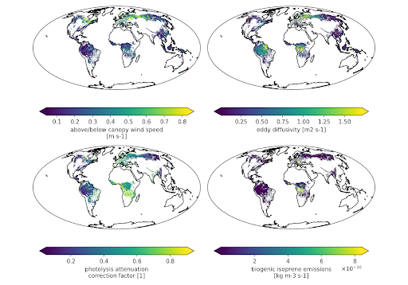

<h1>
 [](https://github.com/noaa-oar-arl/canopy-app/blob/main/LICENSE)
[](https://github.com/noaa-oar-arl/canopy-app/actions/workflows/ci.yml)
[](https://github.com/noaa-oar-arl/canopy-app/actions/workflows/docs.yml)
[](https://noaa-oar-arl.github.io/canopy-app/)
[](https://doi.org/10.5281/zenodo.8403649)ref="https://github.com/noaa-oar-arl/canopy-app">
    
  </a>
</h1>

[](https://github.com/noaa-oar-arl/canopy-app/blob/main/LICENSE)
[](https://github.com/noaa-oar-arl/canopy-app/actions/workflows/ci.yml)
[](https://github.com/noaa-oar-arl/canopy-app/actions/workflows/pages.yml)
[](https://doi.org/10.5281/zenodo.8403649)

Repository for low-level, stand-alone/column canopy parameterizations for testing and application to gridded atmospheric composition/air quality models.

Authors: Patrick Campbell, Zachary Moon, Wei-Ting Hung, Margaret Marvin, Quazi Rasool, and other NOAA research team members.

##  Documentation

📚 **[View Documentation](https://noaa-oar-arl.github.io/canopy-app/)** - Complete user guide, API reference, and examples

## Documentation

The Canopy-App documentation is built with MkDocs and automatically deployed to GitHub Pages.

### Online Documentation

- **📚 [Main Documentation](https://noaa-oar-arl.github.io/canopy-app/)** - Complete user guide, API reference, and examples hosted on GitHub Pages
- **🔧 [ReadTheDocs](https://canopy-app.readthedocs.io/en/latest/)** - Alternative documentation mirror (optional)

### Building Documentation Locally

For first-time setup, you can use the automated setup:
```bash
# First-time setup (installs dependencies and validates configuration)
./scripts/docs.sh setup
```

Or manually install and build:
```bash
# Install documentation dependencies
pip install -r requirements-docs.txt

# Build documentation
mkdocs build

# Serve documentation locally (with hot reload)
mkdocs serve
```

The documentation will be available at `http://127.0.0.1:8000`.

### Documentation Deployment

The documentation is automatically built and deployed when:
- **Main branch**: Deploys to GitHub Pages as the primary documentation site
- **Pull requests**: Creates preview documentation for review (via separate workflow)
- **Manual trigger**: Can specify custom version for deployment

For manual deployment:
```bash
# Deploy latest version to GitHub Pages
./scripts/docs.sh deploy

# Deploy specific version with versioning
./scripts/docs.sh deploy v1.0.0

# Build only (no deployment)
./scripts/docs.sh build

# Serve locally with hot reload
./scripts/docs.sh serve

# First-time setup and validation
./scripts/docs.sh setup
```

### GitHub Pages Setup

To enable GitHub Pages for your fork:
1. Go to your repository's **Settings** > **Pages**
2. Set **Source** to "GitHub Actions"
3. The documentation will be automatically deployed on the next push to main

## Getting Started

### Build

Canopy-App requires NetCDF-Fortran Libraries (i.e., `-lnetcdf -lnetcdff`) when using the 1D/2D NetCDF I/O Option (i.e., `infmt_opt=0`).
See [the included Makefile](./src/Makefile), which detects NetCDF using `nf-config`, for an example (on GMU Hopper, you can use the `netcdf-c/4.7.4-vh` and `netcdf-fortran/4.5.3-ff` modules).

Compilation options can be controlled with environment variables:

- `FC=gfortran` (default) or compiler name/path (e.g. `FC=ifort`, `FC=gfortran-11`, `FC=/usr/bin/gfortran-11`)
- `DEBUG=0` (off; default) or `DEBUG=1` (on) or `DEBUG=2` (more flags, including FPE traps and traceback)
- `NC=0` (off) or `NC=1` (on; default)

Example:
a) with compiler set by `FC` environment variable (falling back to `gfortran` if unset), Debug flags ON and with NetCDF:
```
DEBUG=1 NC=1 make -C src
```
Note: Not supplying `FC` doesn't necessarily give `gfortran`, since `FC` might already be set in the environment (for example, `module load` situations may do this). In such case do:
```
DEBUG=1 NC=1 FC=gfortran make -C src
```
b) with Intel Fortran (`ifort`), Debug flags ON and with NetCDF:
```
DEBUG=1 NC=1 FC=ifort make -C src
```

### Modify settings

If necessary, modify [the settings](#table-3-current-user-namelist-options) in the Fortran namelist file [`input/namelist.canopy`](./input/namelist.canopy),
which is read at runtime.

### Run

```
./canopy
```

You can also [generate global inputs and run with Python](./python/README.md).

## Components

Current Canopy-App components:

1.  In-Canopy Winds and Wind Adjustment Factor (WAF) for wildfire spread and air quality applications.  Based on Massman et al. (2017).

    Namelist Option : `ifcanwind` and/or `ifcanwaf` Output Variables: `ws` (m s-1) `waf` (fraction)

    - `canopy_wind_mod.F90`
    - `canopy_waf_mod.F90`

2.  In-Canopy vertical diffusion (i.e., eddy diffusivities used to scale resolved model layer 1 diffusion).  Based on Massman et al. (2017) and Makar et al. (2017).

    Namelist Option : `ifcaneddy`  Output Variables:  `kz` (m2 s-1)

    - `canopy_eddyx_mod.F90`

3.  In-Canopy photolysis attenuation (i.e., used to scale resolved model layer 1 photolysis).  Based on Massman et al. (2017) and Markar et al. (2017).

    Namelist Option : `ifcanphot`  Output Variables: `rjcf` (fraction)

    - `canopy_phot_mod.F90`

4.  In-Canopy leaf-level biogenic emissions (kg m-3 s-1). Based on MEGANv2 and v3 (Guenther et al., 2012), and using both Clifton et al. (2021) and Silva et al. (2020) parameterizations.

    - Note the emissions here are at leaf-level and the units are in per m3 (in each canopy layer volume using the LAD/biomass distribution) for the respective vegetation type in each grid cell/point. This is different then MEGANv2 or v3, as such models approximate combined activity factors per canopy level, sum them weighted to a given biomass distribution, and use total LAI to calculate the "big-leaf" 2D flux of biogenic emissions to the overlying atmosphere.  Thus, to get 2D total flux of biogenic emissions per m2 from Canopy-App, the explicit leaf-level emissions profile must be integrated across the individual canopy layer depths/resolutions (i.e., "modres", see [Table 3](#table-3-current-user-namelist-options)).  Since the modres is constant in Canopy-App, the layers can be directly summed and then multiplied by modres to get kg m-2 s-1. This sum neglects any effects of time integrated losses and/or chemistry that would reduce total biogenic emissions flux from the canopy.  When fractional vtypes (i.e., land use) are used, the summed layers can be multiplied by the fractional grid box areal coverage for each vegetation types in the grid cell.  However, for the current dominant vtype approach as input to Canopy-App and many UFS applications this multiplicative fraction = 1.

    Namelist Option : `ifcanbio`   Output Variables: see [Table 1](#table-1-canopy-app-biogenic-emissions-output-variables) below

    - `canopy_bioemi_mod.F90`


5.  In-Canopy leaf-level gas dry deposition (cm s-1). Based on the revised parameterization for gaseous dry deposition from Zhang et al. (2003), and adapted from the Atmospheric Chemistry and Canopy Exchange Simulation System (ACCESS), Saylor (2013). Ground soil underneath and outside canopy (i.e., barren vtype) follows ACCESS soils.  Drydep to urban vtypes follows [Gao and Shen 2018](https://www.sciencedirect.com/science/article/pii/S0360132318301185) and uses building reaction probabilities (gamma) and Maxwell-Boltzmann average gas velocities (Cave=sqrt(8RT/pi*M)).  Drydep to water vtype surfaces follows [CMAQv5.5](https://github.com/USEPA/CMAQ) and depends on above water air temperature, humidity, friction velocity, and Henry's Law.  Drydep to snow/ice vtypes follow [CMAQv5.5](https://github.com/USEPA/CMAQ) methods for snow/ice resistances and reactivities relative to HNO3. Snow/ice cover is dynamic and depends on predicted snow/ice (`snowc_ave` and `icec`) cover conditions.

Namelist Option : `ifcanddepgas`   Output Variables: see [Table 2](#table-2-canopy-app-gas-dry-deposition-output-variables-racm2) below for the Regional Atmospheric Chemistry Model, version 2 (RACM2) [Goliff et al., 2013](https://doi.org/10.1016/j.atmosenv.2012.11.038) gas phase chemical mechanism (currently only option) including transported species

    - `canopy_drydep_mod.F90`

## Outputs

Namelist Option : `file_out`  Prefix string (e.g., `'test'`) used to name output file (Output is 1D txt when using input 1D data (i.e., `infmt_opt=1`), or is 2D NetCDF output when 2D NetCDF input is used (i.e., `infmt_opt=0`)).

Current 3D fields include canopy winds (`canwind`), canopy vertical/eddy diffusivity values `kz`), biogenic emissions (see Table 1 below),
canopy photolysis attenuation correction factors (`rjcf`), and derived Leaf Area Density (`lad`) from the foliage shape function.

Current 2D fields includes the Wind Adjustment Factor (`waf`), flame heights (`flameh`), and canopy heights (`canheight`). Current 1D fields include the canopy model interface levels (`z`).

**Note for Biogenic emissions:** When `ifcanbio=.TRUE.`, output will include 3D canopy resolved biogenic emissions for the following species (based on Guenther et al., 2012), which have been mapped from Guenther et al. PFTs to input LU_OPT.

### Table 1. Canopy-App Biogenic Emissions Output Variables

| Variable Name | Variable Description (Units: kg m-3 s-1)  | ID Number |
| ------------- | ----------------------------------------- | --------- |
| `emi_isop`    | Isoprene                                  | 1         |
| `emi_myrc`    | Myrcene                                   | 2         |
| `emi_sabi`    | Sabinene                                  | 3         |
| `emi_limo`    | Limonene                                  | 4         |
| `emi_care`    | 3-Carene                                  | 5         |
| `emi_ocim`    | t-beta-Ocimene                            | 6         |
| `emi_bpin`    | beta-Pinene                               | 7         |
| `emi_apin`    | alpha-Pinene                              | 8         |
| `emi_mono`    | Other Monoterpenes (34 compounds, Table 1 Guenther et al. (2012) |  9         |
| `emi_farn`    | alpha-Farnesene                           | 10        |
| `emi_cary`    | beta-Caryophyllene                        | 11        |
| `emi_sesq`    | Other Sesquiterpene (30 compounds, Table 1 Guenther et al. (2012) | 12        |
| `emi_mbol`    | 232-MBO emissions                         | 13        |
| `emi_meth`    | Methanol emissions                        | 14        |
| `emi_acet`    | Acetone emissions                         | 15        |
| `emi_co`      | Carbon Monoxide emissions                 | 16        |
| `emi_bvoc`    | Bi-Directional VOC emissions (5 compounds, Table 1 Guenther et al. (2012) | 17        |
| `emi_svoc`    | Stress VOC emissions (15 compounds, Table 1 Guenther et al. (2012) | 18        |
| `emi_ovoc`    | Other VOC emissions (49 compounds, Table 1 Guenther et al. (2012) | 19        |

### Table 2. Canopy-App Gas Dry Deposition Output Variables RACM2

| Variable Name | Variable Description (Units: cm s-1)      | ID Number |
| ------------- | ----------------------------------------- | --------- |
| `ddep_no`     | Nitric Oxide                                       | 1         |
| `ddep_no2`    | Nitrogen Dioxide                                   | 2         |
| `ddep_o3`     | Ozone                                              | 3         |
| `ddep_hono`   | Nitrous Acid                                       | 4         |
| `ddep_hno4`   | Peroxynitric Acid                                  | 5         |
| `ddep_hno3`   | Nitric Acid                                        | 6         |
| `ddep_n2o5`   | Dinitrogen Pentoxide                               | 7         |
| `ddep_co`     | Carbon Monoxide                                    | 8         |
| `ddep_h2o2`   | Hydrogen Peroxide                                  | 9         |
| `ddep_ch4`    | Methane                                            | 10        |
| `ddep_mo2`    | Methylperoxy Radical                               | 11        |
| `ddep_op1`    | Methyl Hydrogen Peroxide                           | 12        |
| `ddep_moh`    | Methanol                                           | 13        |
| `ddep_no3`    | Nitrate Radical                                    | 14        |
| `ddep_o3p`    | Ground State Oxygen Atoms                          | 15        |
| `ddep_o1d`    | Excited State Oxygen Atoms                         | 16        |
| `ddep_ho`     | Hydroxyl Radical                                   | 17        |
| `ddep_ho2`    | Hydroperoxyl Radical                               | 18        |
| `ddep_ora1`   | Formic Acid                                        | 19        |
| `ddep_hac`    | Acetic Acid                                        | 20        |
| `ddep_paa`    | Peroxyacetic Acid                                  | 21        |
| `ddep_dhmob`  | Dihydroxy Carbonyl                                 | 22        |
| `ddep_hpald`  | Hydroperoxymethyl-Butenals                         | 23        |
| `ddep_ishp`   | Beta-Hydroxy Hydroperoxides from ISOP+HO2          | 24        |
| `ddep_iepox`  | Isoprene Epoxydiol                                 | 25        |
| `ddep_propnn` | Propanone Nitrate                                  | 26        |
| `ddep_isopnb` | Beta-Hydroxy Isoprene Nitrates                     | 27        |
| `ddep_isopnd` | Delta-Hydroxy Isoprene Nitrates                    | 28        |
| `ddep_macrn`  | Methacrolein Nitrate                               | 29        |
| `ddep_mvkn`   | Methylvinylketone Nitrate                          | 30        |
| `ddep_isnp`   | ISNP                                               | 31        |


## Inputs and Settings

**Current Canopy-App Input:** Typical 1D or 2D (time=1,lat,lon) gridded atmospheric model input variables in 1st layer above canopy.  Some 3D inputs are supported (see `var3d_opt` in [Table 3](#table-3-current-user-namelist-options) and associated options).

Namelist Option : `file_vars`  Full name of input file (Supports either text or NetCDF format with following formats: `.txt`, `.nc`, `.ncf`, or `.nc4`)

- See example file inputs for variables and format (`gfs.t12z.20220701.sfcf000.canopy.txt` or `gfs.t12z.20220701.sfcf000.canopy.nc`).  Example surface met/land/soil inputs are based on NOAA's UFS-GFSv16 inputs initialized on July 01, 2022 @ 12 UTC (forecast at hour 000). Other external inputs for canopy related and other calculated variables are from numerous sources.  See [Table 2](#table-2-canopy-app-required-input-variables) below for more information.  **Note:** The example GFSv16 domain has been cut to the southeast U.S. region only in this example for size/time constraints here.
- Canopy-App assumes the NetCDF input files are in CF-Convention and test file is based on UFS-GFSv16; recommend using double or float for real variables.  Input data must be valid values.
- Canopy-App can also be run with a single point of 1D input data in a text file (e.g. `point_file_20220701.sfcf000.txt`).
- The namelist can be modified with [f90nml](https://f90nml.readthedocs.io/en/latest/cli.html) (included with the [Canopy-App Conda](https://github.com/noaa-oar-arl/canopy-app/blob/develop/python/environment.yml) environment) to insert multiple input filenames at once:
  ```
  f90nml -g filenames -v file_vars="$(realpath *.txt | xargs -I {} echo "'{}'")" namelist.canopy namelist.canopy_copy
  ```

The Canopy-App input data in [Table 2](#table-2-canopy-app-required-input-variables) below is based around NOAA's UFS operational Global Forecast System Version 16 (GFSv16) gridded met data, and is supplemented with external canopy data (from numerous sources) and other external and calculated input variables.

### Table 2. Canopy-App Required Input Variables

| **GFS /Met/Land/Soil Variables** | **Variable Description and Units**          | **Example Data Sources/References (if necessary)** |
| -------------------------------- | ------------------------------------------- | -------------------------------------------------- |
| `lat`                            | Latitude  (degrees)                         | N/A                                                |
| `lon`                            | Longitude (degrees; from 0-360)             | N/A                                                |
| `time`                           | Timestamp (days since YYYY-N-D 0:0:0) (NetCDF Only) | N/A                                        |
| `ugrd10m`                        | U wind at reference height above canopy (m/s), e.g., 10 m | UFS NOAA/GFSv16 *(see below for downloading using AWS) |
| `vgrd10m`                        | V wind at reference height above canopy  (m/s), e.g., 10 m | UFS NOAA/GFSv16                     |
| `vtype`                          | Vegetation type (dimensionless), VIIRS or MODIS | UFS NOAA/GFSv16                                |
| `fricv`                          | Friction velocity (m/s)                     | UFS NOAA/GFSv16                                    |
| `sfcr`                           | Total surface roughness length (m)          | UFS NOAA/GFSv16                                    |
| `sotyp`                          | Soil type (dimensionless), STATSGO          | UFS NOAA/GFSv16                                    |
| `pressfc`                        | Surface pressure (Pa)                       | UFS NOAA/GFSv16                                    |
| `dswrf`                          | Instantaneous downward shortwave radiation at surface (W/m2) | UFS NOAA/GFSv16                   |
| `shtfl`                          | Instantaneous sensible heat flux at surface (W/m2) | UFS NOAA/GFSv16                             |
| `tmpsfc`                         | Surface temperature (K)                     | UFS NOAA/GFSv16                                    |
| `tmp2m`                          | 2-meter temperature (K)                     | UFS NOAA/GFSv16                                    |
| `tmp_hyblev1`                    | 1st hybrid model layer temperature (K)      | UFS NOAA/GFSv16                                    |
| `spfh2m`                         | 2-meter specific humidity (kg/kg)           | UFS NOAA/GFSv16                                    |
| `hpbl`                           | Height of the planetary boundary layer (m)  | UFS NOAA/GFSv16                                    |
| `prate_ave`                      | Average mass precipitation rate (kg m-2 s-1) | UFS NOAA/GFSv16                                   |
| `snowc_ave`                      | Average percent snow cover (%)               | UFS NOAA/GFSv16                                   |
| `icec`                           | Average fraction ice cover (dimensionless)   | UFS NOAA/GFSv16                                   |
| `soilw1`                         | Volumetric soil moisture in layer 1 (m3 m-3) | UFS NOAA/GFSv16                                   |
| `soilw2`                         | Volumetric soil moisture in layer 2 (m3 m-3) | UFS NOAA/GFSv16                                   |
| `soilw3`                         | Volumetric soil moisture in layer 3 (m3 m-3) | UFS NOAA/GFSv16                                   |
| `soilw4`                         | Volumetric soil moisture in layer 4 (m3 m-3) | UFS NOAA/GFSv16                                   |
| `soilt1`                         | Soil temperature in layer 1 (K)              | UFS NOAA/GFSv16                                   |
| `soilt2`                         | Soil temperature in layer 2 (K)              | UFS NOAA/GFSv16                                   |
| `soilt3`                         | Soil temperature in layer 3 (K)              | UFS NOAA/GFSv16                                   |
| `soilt4`                         | Soil temperature in layer 4 (K)              | UFS NOAA/GFSv16                                   |
| `wilt`                           | Wilting point (proportion)                   | UFS NOAA/GFSv16                                    |
| **External Canopy Variables**    | **Variable Description and Units**          | **Data Source/Reference (if necessary)**           |
| `ch`                             | Canopy height (m)                    | Globally extended GEDI data. Data Period=2020. Data frequency=Annual. ([Lang et al., 2023](https://doi.org/10.1038/s41559-023-02206-6)) |
| `clu`                            | Canopy clumping index (dimensionless)       | GriddingMachine/MODIS. Data Period=2001-2017 Climatology. Data frequency=Monthly. ([Wei et al., 2019](https://doi.org/10.1016/j.rse.2019.111296)). Extended globally for high latitudes using methods described [here](https://gmuedu-my.sharepoint.com/:w:/g/personal/whung_gmu_edu/EdglXmW2kzBDtDj1xV0alGcB1Yo2I8hzdyWGVGB2YOTfgw). |
| `lai`                            | Leaf area index (m2/m2)                     | VIIRS-NPP. Data Period=2022. Data frequency=Monthly, averaging from S-NPP ([Myneni 2023](https://doi.org/10.5067/VIIRS/VNP15A2H.002)) and NOAA-20 ([Myneni 2023](https://doi.org/10.5067/VIIRS/VJ115A2H.002)) products. Extended globally for high latitudes using methods described [here](https://gmuedu-my.sharepoint.com/:w:/g/personal/whung_gmu_edu/EdglXmW2kzBDtDj1xV0alGcB1Yo2I8hzdyWGVGB2YOTfgw). |
| `canfrac`                          | Canopy green vegetation fraction (dimensionless)             | Based on [VIIRS GVF](https://www.star.nesdis.noaa.gov/jpss/gvf.php). Data Period=2022. Data frequency=Monthly, averaging from S-NPP and NOAA-20 products ([NOAA CLASS](https://www.aev.class.noaa.gov/saa/products/search?sub_id=0&datatype_family=JPSS_NGRN)). Extended globally for high latitudes using methods described [here](https://gmuedu-my.sharepoint.com/:w:/g/personal/whung_gmu_edu/EdglXmW2kzBDtDj1xV0alGcB1Yo2I8hzdyWGVGB2YOTfgw). |
| `pavd`                           | Plant area volume density (m2/m3)           | [GEDI product from North Arizona University](https://goetzlab.rc.nau.edu/index.php/gedi/). Data Period=201904-202212 Climatology. Data frequency=Annual. Three dimensional structure of plant area volume density with 14 vertical layers from the surface (0 m) to 70 m above ground level. Data at each layer represents the average pavd within certain height range (e.g. 0 - 5 m for first layer). |
| `lev`                            | Height AGL for levels associated with optional pavd (or other canopy profile) inputs (m)                                  | Same as for GEDI PAVD (or other canopy profile inputs) above                                    |
| **Other External Variables**     | **Variable Description and Units**          | **Data Source/Reference (if necessary)**           |
| `frp`                            | Total Fire Radiative Power (MW/grid cell area) | [NOAA/NESDIS GBBEPx](https://www.ospo.noaa.gov/Products/land/gbbepx/) |
| `csz`                            | Cosine of the solar zenith angle (dimensionless) | [Based on Python Pysolar](https://pysolar.readthedocs.io/en/latest/) |
| `mol`                            | Monin-Obukhov Length (m)                    | Externally calculated using GFS `tmp2m`, `fricv`, and `shtfl`.  ([Essa, 1999](https://inis.iaea.org/collection/NCLCollectionStore/_Public/37/118/37118528.pdf)) |
| `href`                           | Reference height above canopy (m) - 10 m    | Assumed constant (i.e., 10 m).  Can be taken from NL. |
| `ozone_w126`                     | Ozone W126 index (ppm-hours)                | A three year climatological calculation between 04/2021-04/2024, based on GFSv16 lowest model layer ozone mixing ratios.  The W126 calculation is based on the [EPA definition](https://www.epa.gov/sites/default/files/2015-09/documents/w126_steps_to_calculate_revised_feb19.pdf). |

**More Information on Data Sources from [Table 2](#table-2-canopy-app-required-input-variables):**

**Global GFS meteorological files are available on [AWS](https://registry.opendata.aws/noaa-oar-arl-nacc-pds/):**

```
https://noaa-oar-arl-nacc-pds.s3.amazonaws.com/inputs/
```

Hourly gridded GFSv16 data is available from March 23, 2021 - Current Day and is supplemented by calculated and canopy parameters shown in Table 2.

**Global 13-km global canopy files (based on 2020 - 2022 satellite data; variable varying) combined with 2022 GFS meteorology are available on [AWS](https://registry.opendata.aws/noaa-oar-arl-nacc-pds/):**

```
https://noaa-oar-arl-nacc-pds.s3.amazonaws.com/inputs/geo-files/
```

**and global 1-km canopy data representative of 2020 is available on [NCEI](https://www.ncei.noaa.gov/access/metadata/landing-page/bin/iso?id=gov.noaa.nodc:0295750)**

**GriddingMachine:** GriddingMachine is open source database and software for Earth system modeling at global and regional scales.  Data is easily accessible in consistent formats for ease of downloading/processing.  All available datasets may be found at:  https://github.com/CliMA/GriddingMachine.jl. ([Wang et al., 2022](https://doi.org/10.1038/s41597-022-01346-x)).

**For GMU Hopper users, daily global canopy files for 2022 at 12 UTC are available at**

```
/groups/ESS/whung/canopy_wind/gfsv16_test_data/test_2022
```


**For NOAA Hera users, daily global canopy files for 2022 at 12 UTC are available at**

```
/scratch1/RDARCH/rda-arl-gpu/Wei-ting.Hung/Global_canopy/canopy_app_2022
```

**For NOAA HPSS users (e.g., Hera or WCOSS2), hourly operational GFSv16 meteorology files are archived at (following 07/01/2024)**

```
 /NAGAPE/arl/5year/Patrick.C.Campbell//yyyy_GFSv16_prod/
```
Otherwise, please contact Patrick.C.Campbell@noaa.gov for other GFSv16 data periods.


**Near-real-time hourly GFSv16 outputs are on WCOSS2 at**

```
/lfs/h1/ops/prod/com/gfs/v16.3/gfs.yyyymmdd/12/atmos/
```

### Table 3. Current User Namelist Options

| Namelist Option | Namelist Description and Units                                                     |
| --------------- | ---------------------------------------------------------------------------------- |
|                 | **Input model format options**                                                     |
| `infmt_opt`     | integer for choosing 1D or 2D text (= `1`)  or 2D NetCDF input file format (= `0`, default) |
|                 | **Input model grid sizes**                                                         |
| `nlat`          | number of latitude cells (must match # of LAT in `file_vars` above)                |
| `nlon`          | number of longitude cells (must match # of LON in `file_vars` above)               |
|                 | **Input model run times and interval**                                             |
| `time_start`    | Start/initial time stamp in YYYY-MM-DD-HH:MM:SS.SSSS for simulation/observation inputs  |
| `time_end`      | End time stamp in YYYY-MM-DD-HH:MM:SS.SSSS for simulation/observation inputs       |
| `ntime`         | Number of time steps for simulation/observation inputs                             |
| `time_intvl`    | Integer time interval for simulation/observation input time steps in seconds (e.g. 3600 for hourly time stpes and 24*3600 for daily time steps) |
|                 | **Canopy model vegetation/land use input dataset options**                         |
| `lu_opt`        | integer for input model land use type (`0`: VIIRS 17 Cat (default) or `1`: MODIS-IGBP 20 Cat (valid LU types 1-10 and 12); input mapped to Massman et al.) |
|                 | **Input model 3d NetCDF variable options                 |
| `var3d_opt`     | integer for selecting to use 3D variable in NetCDF file (e.g., 'PAVD') or to read supplementary canopy text file inputs (`file_canvars`).  (= `0`, default, off) or (= `1`, on). `file_canvars` read only when `infmt_opt` = 1 and `var3d_opt` = 1.  This is used with the number of levels defined by `var3d_set` below |
| `var3d_set`     | integer for selecting number of 3D input levels, only used when setting `var3d_opt= `1`, default = 14 (Note:  For input text file the max current levels can only be 14, please input according to example data)  |
|                 | **Options to use observed PAVD profiles and latitude threshold                 |
| `pavd_opt`      | integer for choosing to use GEDI 3D input PAVD profiles instead of prescribed plant distribution functions (= `0`, default, off) or (= `1`, on);  Note: To use this option, must set `var3d_opt= `1`, and the 3D pavd variable must be available in the input NetCDF file (i.e., `file_vars`) or in new auxilliary 3D PAVD text file  |
| `pavd_set`      | real value for +/- latitude threshold within to use observed GEDI 3D PAVD profiles instead of prescribed plant distribution functions.  Used only if `pavd_opt=1`.  Default  = 52.0 degrees latitude.   |
|                 | **Canopy model vertical layers**                                                   |
| `modlays`       | number of model (below and above canopy) layers. Strongly recommend adjusting this in accordance with `modres` option below to maintain canopy model column extension above tallest canopies in simulation domain (e.g.,for a 50 meter column simulation, a user could use 1000 modlays @ 0.05 m resolution,  100 modlays @ 0.5 m resolution, 50 modlays @ 1.0 m resolution, etc.                                     |
| `modres`        | above and below canopy model vertical resolution (m)                               |
|                 | **Contiguous canopy model thresholds**                                             |
| `lai_thresh`    | user-set real value of LAI threshold for contiguous canopy (m2/m2).  Note:  Only applies for valid vegetated land use types (forests,ssg, crops, wetlands)                 |
| `cf_thresh`     | user-set real value of canopy fraction threshold for contiguous canopy. Note:  Only applies for valid vegetated land use types (forests,ssg, crops, wetlands)             |
| `ch_thresh`     | user-set real value of canopy height threshold for contiguous canopy (m). Note:  Only applies for valid vegetated land use types (forests,ssg, crops, wetlands)          |
|                 | **Canopy crop and shrub/savanna/grass extension options**                          |
| `can_opt`       | integer for using either input data  (= `0`, default) or user set canopy vegetation type ch, cf, and lai from namelist (= `1`).  Currently, satellite may have missing ch, cf, or lai for lower forests/tundra and thus FCH=0.  This is important for options such as biogenic emissions, dry deposition, etc, as this would then not have any emissions/drydep for these areas.  Note: use of can_opt=1 will only use `can_chset`, `can_cfset`, or `can_laiset` values if observations are found to be missing, i.e., <=0.0.|
| `can_chset`     | user-set real value of constant canopy vegetation type heights (m) (only used if `can_opt=1`). |
| `can_cfset`     | user-set real value of constant canopy vegetation fraction (only used if `can_opt=1`). |
| `can_laiset`     | user-set real value of constant canopy LAI (only used if `can_opt=1`). |
| `ssg_opt`       | integer for using either input data  (= `0`, default) or user set shrub/savanna/grass (SSG) vegetation type ch, cf, and lai from namelist (= `1`).  Currently, satellite input data may not provide canopy heights, fractions, or lai for very low-lying vegetation such as SSG types, and thus FCH=0 for example.  This is important for options such as biogenic emissions, dry deposition, etc. as this would then not have any emissions/drydep for these areas.  Note: use of ssg_opt=1 will only use `ssg_chset`, `ssg_cfset`, or `ssg_laiset` values if observations are found to be missing, i.e., <=0.0.| |
| `ssg_chset`     | user-set real value of constant SSG vegetation type heights (m) (only used if `ssg_opt=1`).  We recommend setting this to a low value, e.g., ssg_set=0.5 or 1.0 (meters) when `ssg_opt=1` |
| `ssg_cfset`     | user-set real value of constant SSG vegetation fraction (only used if `ssg_opt=1`). |
| `ssg_laiset`     | user-set real value of constant SSG LAI (only used if `ssg_opt=1`). |
| `crop_opt`      | integer for using either input data  (= `0`, default) or user set crop vegetation type ch, cf, and lai from namelist (= `1`).  Note: use of crop_opt=1 will only use `crop_chset`, `crop_cfset`, or `crop_laiset` values if observations are found to be missing, i.e., <=0.0.|  |
| `crop_chset`    | user-set real value of constant crop vegetation type heights (m) (only used if `crop_opt=1`) |
| `crop_cfset`    | user-set real value of constant crop vegetation fraction (only used if `crop_opt=1`) |
| `crop_laiset`    | user-set real value of constant crop LAI (only used if `crop_opt=1`) |
|                 | **Canopy physics and wind-specific options**                                       |
| `ifcanwind`     | logical canopy wind option (default: `.FALSE.`)                                    |
| `href_opt`      | integer for using `href_set` in namelist (= `0`, default) or array from file (= `1`) |
| `href_set`      | user-set real value of reference height above canopy associated with input wind speed (m) (only used if `href_opt=0`) **\*\*\*** |
| `z0ghc`         | ratio of ground roughness length to canopy top height (Massman et al., 2017)       |
| `rsl_opt`       | user-set option for either MOST or unified Roughness SubLayer (RSL) effects above and at canopy top (Uc).(= `0`, default: uses MOST and a constant lambdars factor only), (= `1`, under development: will use a more unified RSL approach from Bonan et al. (2018) and Abolafia-Rosenzweig et al., 2021)   |
| `lambdars`      | Value representing influence of RSL effects (with `rsl_opt=0`) (Massman et al., 2017)          |
| `pai_opt`       | integer (`0`: PAI fixed from Katul et al. 2004 veg types-->default; `1`: PAI Massman et al. 2017 Eq. 19 calc; `2`: PAI from model LAI (based on PAI=LAI/(1-alpha), where alpha is the "woody-to-total area ratio" and is vegetation type dependent.  Based on Figure 1 of Fang et al. (2019) (https://doi.org/10.1029/2018RG000608) and combining Eqs. 10 and 14 in  Zou et al., 2009 (https://doi.org/10.1093/treephys/tpp042) ; `3`: user-set PAI value) |
| `pai_set`       | user-set real value of PAI (default: `4.0`; only used if `pai_opt=3`)              |
| `z0_opt`        | integer (`0`: use model input or `1`: vegtype dependent z0 for first estimate)     |
|                 | **Canopy fire/WAF-specific options**                                               |
| `ifcanwaf`      | logical canopy WAF option (default: `.FALSE.`) **\*\***                            |
| `dx_opt`        | `0`: Calculation of dx resolution/distance from lon; `1`: user-set dx grid resolution |
| `dx_set`        | user-set real value of grid resolution (m) only if `dx_opt=1`                      |
| `flameh_opt`    | `0`: Calculation of vegtype dependent flame height from FRP (i.e., fire intensity); Note: this uses the one of two FRP calculation methods based on `flameh_cal` below;  `1`: user-set flameh; `2`: FRP calculation where available (active fires), elsewhere user-set `flameh`; `3`: FlameH override, i.e., only uses fraction of canopy height (`flameh_set` must be <=1.0) as a surrogate for `flameh`; `4`: FRP calculation where available (active fires) and FlameH override elsewhere (same as option 3); `5`: FRP/intensity dependent (i.e., sub-canopy vs. crown fires) calculation where available (active fires) and FlameH override elsewhere (same as option 3). If option 5 is used and crowning is calculated, then the total flame height (i.e., top of canopy=FCH) is used instead of 1/2 flame height. |
| `flameh_cal`    | `0`: Calculates the vegtype dependent flame height from FRP, based on Table 1 of Alexander and Cruz (2012) and assuming that flame height = flame length (overestimates flame height in high winds and/or slope conditions).  `1`: Calculates the vegtype dependent flame height from FRP based on Table 2 and Equation 14 of Alexander and Cruz (2012).  These relate flame height directly to crown scorch height, which is derived from FRP. This method assumes that the ambient temperature is in the experimental ranges from Table 3 of Alexander and Cruz (2012), and that the lethal temperature for burning foliage is 60.0 C.           |
| `flameh_set`    | user-set real value of flame height (m) if `flameh_opt=1` or `2`, or `flameh` = fraction of canopy height (<=1.0), i.e., `flameh` override, if `flameh_opt=3`, `4`, or `5` |
| `frp_fac`       | user-set real value of tuning factor applied to FRP in calculation of flame height (default: 1.0). Used only if `flameh_opt=0`, `2`, `4`, or `5`. |
|                 | **Canopy eddy diffusivity-specific options**                                       |
| `ifcaneddy`     | logical canopy eddy Kz option (default: `.FALSE.`)                                 |
|                 | **Canopy radiation/photolysis-specific options**                                   |
| `ifcanphot`     | logical canopy photolysis option (default: `.FALSE.`)                              |
|                 | **Canopy biogenic emissions-specific options**                                     |
| `ifcanbio`      | logical canopy biogenic emissions option (default: `.FALSE.`)                      |
| `bio_cce`       | user-set real value of MEGAN biogenic emissions "canopy environment coefficient" used to tune emissions to model inputs/calculations (default: `0.21`, based on Silva et al. 2020) |
| `biospec_opt`   | user set option to select species for NetCDF biogenic emissions output (`0`: all species; `1-19`: one species selected according to ID number - Table 1) (default: 0; ID number for single species selection only used if `infmt_opt=0`)        |
| `biovert_opt`   | user set biogenic vertical summing option (`0`: no sum, full leaf-level biogenic emissions, units=kg/m3/s; `1`: MEGANv3-like summing of LAD weighted activity coefficients using the canopy-app plant distributions, caution-- units=kg m-2 s-1 and puts the total emissions in the topmost canopy-app model layer only; `2`: Same as in option 1, but instead uses Gaussian/normally weighted activity coefficients acoss all sub-canopy layers -- also units of kg m-2 s-1 in topmost model layer; `3`: Same as in option 1, but instead uses evenly weighted activity coefficients acoss all sub-canopy layers -- also units of kg m-2 s-1 in topmost model layer          |
| `loss_opt`      | user set option to apply a canopy loss factor when the vertical summing option is used (`biovert_opt >= 1`) to facilitate comparison of top-of-canopy BVOC emissions with ground flux observations.  (`0`: no loss factor applied, `1`: loss factor calculated based on Eq. 21 of [Guenther et al. (2006)](www.atmos-chem-phys.net/6/3181/2006/) based on the formulation and empirical parameters for isoprene, `2`: constant user set factor applied with `loss_set` below, Note:  The loss factor can be applied to all or any single biogenic species (using `loss_ind` below), and caution must be used for other BVOC species besides isoprene.  User may adjust the variable chemical lifetime (`lifetime`, default = 3600 s taken for approximate isoprene lifetime) below and re-run to target other specific BVOC species flux observation comparisons.   |
| `loss_set`      | Set default value for constant canopy loss factor applied used when `loss_opt=2` (Default = 0.96 based on Guenther et al. (2006)  |
| `loss_ind`      | Set default integer for applying canopy loss factor to all species (=0) or only specific biogenics species specific indice (> 0) based on Table 1 above (e.g., 1 = Isoprene, 2 = Myrcene, etc.)   |
| `lifetime`      | user-set real value of chemical lifetime (in seconds) used when `loss_opt=1`.  Default = 3600 s based on approximate above canopy isoprene lifeftime of 1 hour.   |
| `co2_opt`       | user-set options for applying a CO2 inhibition factor for biogenic isoprene-only emissions using either the [Possell & Hewitt (2011)](https://doi.org/10.1111/j.1365-2486.2010.02306.x) (= `0`, default) or [Wilkinson et al. (2009)](https://doi.org/10.1111/j.1365-2486.2008.01803.x) method (= `1`). Use of option = `1` (Possell & Hewitt 2011) is especially recommended for sub-ambient CO2 concentrations.  To turn off co2 inhibition factor set `co2_opt=2`  |
| `co2_set`       | user-set real value of atmospheric co2 concentration (ppmv) (only used if `co2_opt=0` or `co2_opt=1`) |
| `leafage_opt`   | user-set options for applying leaf-age response to biogenic VOC emissions based on [Guenther et al. 2006](https://doi.org/10.5194/acp-6-3181-2006) (default is off i.e., `leafage_opt=1`, the corresponding $\gamma$ is set to 1). If turned on (`leafage_opt=0`), leafage $\gamma$ is calculated and the lai_tstep option needs to be set to ensure correct interpolation in this leafage_opt calculation. |
| `lai_tstep`     | user-defined options for the number of seconds in the interval at which LAI (Leaf Area Index) data is provided to the model. For instance, if LAI data is given on a daily basis, lai_tstep would be set to the number of seconds in a day (86,400 seconds). If LAI data is provided monthly, then lai_tstep would represent the total number of seconds in that month (e.g., 2,592,000 seconds for a 30-day month). This parameter helps in determining the frequency of LAI input and is crucial for interpolating LAI values to the model's hourly timesteps when the model's timestep (time_intvl) is smaller than the LAI input interval.  |
| `hist_opt`      | user-set option to use historically averaged short-term (24-hr) and long-term (240-hr) rolling averages for leaf temperature and PAR for biogenic emissions  (default is off i.e., `hist_opt=0`)  Note: If simulation is </= 24 hours, instantaneous values for leaf temperature and PAR will be used even if historical averaging is turned on (i.e., `hist_opt=1`).  Recommend turning on `hist_opt=1` and running at least for 25 hours to create a model spin-up, and use subsequent simulation hours for analysis. Overall a 10-day (240 hr) spinup is optimal for best analysis of biogenic emissions. |
| `soim_opt`   | user-set options for applying soil moisture response to biogenic VOC emissions based on [Guenther et al. 2006](https://doi.org/10.5194/acp-6-3181-2006), which depends on input soil moisture at depth and the wilting point.  This includes additional PFT dependent approach for cumulative root fraction within each soil layer from [Zeng (2001)](https://doi.org/10.1175/1525-7541(2001)002<0525:GVRDFL>2.0.CO;2). (default is off i.e., `soim_opt=1`, the corresponding $\gamma$ is set to 1). If turned on (`soim_opt=0`), which is recommended, soim $\gamma$ is calculated and the prescribed 4-layer soil depths (`soild[1-4]` below) are used.  Four layers are assumed, and are based on GFS Noah and Noah-MP LSM. |
| `soild[1-4]` | user-set real values of four level soil depths at centerpoint (cm).  Four layers are based on the GFS Noah and Noah-MP LSM, default values are `soild1=5.0`, `soild2=25.0`, `soild3=70.0`, and  `soild4=150.0`. |
| `aq_opt`       | user-set options for applying an air quality stress factor for biogenic emissions using calculated, spatially-dependent and global GFS-based ozone W126 values (= `0`) or a constant user-set W126 value (= `1`). To turn off aq stress factor set `aq_opt=2` (set as default, Off).  Note:  The aq_opt should only be turned on during simulations across respective ozone season for specific region (e.g., April-October in the U.S.)|
| `w126_set`       | user-set real value of constant ozone W126 values (ppm-hours) (only used if `aq_opt=1`) |
| `ht_opt`       | user-set options for applying a daily high temperature stress factor for biogenic emissions using daily maximum 2-meter input temperature (= `0`).  This is based on MEGAN3 and it is recommended that this option is only used when turning the historical option on (i.e., `hist_opt=1`) and running longer than 1-day simulations to obtain the daily max.   To turn off ht stress factor set `ht_opt=1` (set as default, Off)  |
| `lt_opt`       | user-set options for applying a daily low temperature stress factor for biogenic emissions using daily minimum 2-meter input temperature (= `0`).  This is based on MEGAN3 and it is recommended that this option is only used when turning the historical option on (i.e., `hist_opt=1`) and running longer than 1-day simulations to obtain the daily min.   To turn off lt stress factor set `lt_opt=1` (set as default, Off) |
| `hw_opt`       | user-set options for applying a daily high wind speed stress factor for biogenic emissions using daily maximum 10-meter input wind speed (= `0`).  This is based on MEGAN3 and it is recommended that this option is only used when turning the historical option on (i.e., `hist_opt=1`) and running longer than 1-day simulations to obtain the daily max.   To turn off hw stress factor set `hw_opt=1` (set as default, Off) |
|                 | **Canopy gas dry deposition-specific options**                                     |
| `ifcanddepgas`  | logical canopy gas dry deposition option (default: `.FALSE.`)                      |
| `ddepspecgas_opt`   | user set option to select species for NetCDF gas dry deposition output (`0`: all species, or e.g., `1-31`: for one species selected according to ID number - Table 2 and the specific gas chemical mechanism (e.g., RACM2) (default: 0; ID number for single species selection only used if `infmt_opt=0`).  Note:  The single number species option should match that desired species from select chemical mechanism option (`chemmechgas_opt`), and not be greater than the total number of species within that gas chemical mechanism option used (`chemmechgas_tot`).         |
| `chemmechgas_opt`   | user set option to select gas chemical mechanism and gas species mapping including transported species.  (`0`: Default = RACM2 mechanism; Only option currently).
| `chemmechgas_tot`   | user set option to define total number of gas species in select gas chemical mechanism (`chemmechgas_opt`) including transported species.  (`31`: Default = RACM2 mechanism; Only option currently).
| `hyblev1`   | user set real value of approximate height AGL of input 1st hybrid model layer associated with input `tmp_hyblev1` ( Default = 20 meters associated with GFSv16; Best used to approximate constant ambient temperature lapse rate with `tmp2m`, particularly in global appliations with areas of extreme soil or skin/surface temperature gradients).
| `snowc_set`      | Set default value for threshold percent snow cover, above which grid/point at ground is treated as dominant covered by snow  (Default = 50%).  Note: This applies at grids/points both beneath the vegetative canopies at ground as well as grids/points outside of contiguous canopies, e.g., barren lands, snow/ice, urban, and water) |
| `icec_set`      | Set default value for threshold percent ice cover, above which grid/point at ground or water is treated as dominant covered by ice  (Default = 50%).  Note: This applies at grids/points both beneath the vegetative canopies at ground as well as grids/points outside of contiguous canopies, e.g., barren lands, snow/ice, urban, and water) |
| `gamma_set`      | Set default reaction probability for gas dry deposition for respective building surface (default = 5.0D-5; Based on average of range in gamma across different building surfaces, e.g., 10-8 for glass and metal to 10-4 for activated carbon and brick; Gao and Shen (2018); https://doi.org/10.1016/j.buildenv.2018.02.046). Note: This only applies across dominant urban grids/points. |
| `Ramin_set`      | Set default minimum aerodynamic resistance for gas dry deposition (Default 10 s/m) |


**\*\*** If `modres` >> `flameh` then some error in WAF calculation will be incurred.  Suggestion is to use relative fine `modres` (at least <= 0.5 m) compared to average flame heights (e.g., ~ 1.0 m) if WAF is required.

**\*\*\*** If `href_set` becomes small and approaches z0 (or as `href_set` --> 0), only the sub-canopy wind profile is calculated, recommend `href_set` = 10 m.

**Note:** Canopy is parameterized by foliage distribution shape functions and parameters for different vegetation types.

- `canopy_profile_mod.F90`

## Global Canopy-App Example (July 01, 2022 at 1200 UTC)



## References

*Further references contained within the source code.*

- Abolafia-Rosenzweig, R., He, C., Burns, S. P., & Chen, F. (2021). Implementation and evaluation of a unified turbulence parameterization throughout the canopy and roughness sublayer in Noah-MP snow simulations. Journal of Advances in Modeling Earth Systems, 13, e2021MS002665. https://doi.org/10.1029/2021MS002665.

- Bonan, G. B., Patton, E. G., Harman, I. N., Oleson, K. W., Finnigan, J. J., Lu, Y., & Burakowski, E. A. (2018). Modeling canopy-induced turbulence in the Earth system: A unified parameterization of turbulent exchange within plant canopies and the roughness sublayer (CLM-ml v0). Geoscientific Model Development, 11, 1467–1496. https://doi.org/10.5194/gmd-11-1467-2018.

- Clifton, O. E., Patton, E. G., Wang, S., Barth, M., Orlando, J., & Schwantes, R. H. (2022). Large eddy simulation for investigating coupled forest canopy and turbulence influences on atmospheric chemistry. Journal of Advances in Modeling Earth Systems, 14, e2022MS003078. https://doi.org/10.1029/2022MS003078

- Guenther, A. B., Jiang, X., Heald, C. L., Sakulyanontvittaya, T., Duhl, T., Emmons, L. K., and Wang, X.: The Model of Emissions of Gases and Aerosols from Nature version 2.1 (MEGAN2.1): an extended and updated framework for modeling biogenic emissions, Geosci. Model Dev., 5, 1471–1492, https://doi.org/10.5194/gmd-5-1471-2012, 2012.

- Katul, G.G., Mahrt, L., Poggi, D., and Sanz, C. (2004). One- and two-equation models for canopy turbulence. Boundary-Layer Meteorol. 113: 81–109. https://doi.org/10.1023/B:BOUN.0000037333.48760.e5

- Makar, P., Staebler, R., Akingunola, A. et al. The effects of forest canopy shading and turbulence on boundary layer ozone. Nat Commun 8, 15243 (2017). https://doi.org/10.1038/ncomms1524

- Massman, W. J., J.M. Forthofer, and M.A. Finney. (2017). An improved canopy wind model for predicting wind adjustment factors and wildland fire behavior. Canadian Journal of Forest Research. 47(5): 594-603. https://doi.org/10.1139/cjfr-2016-0354

- Saylor, R. D.: The Atmospheric Chemistry and Canopy Exchange Simulation System (ACCESS): model description and application to a temperate deciduous forest canopy, Atmos. Chem. Phys., 13, 693–715, https://doi.org/10.5194/acp-13-693-2013, 2013.

- Silva, S. J., Heald, C. L., and Guenther, A. B.: Development of a reduced-complexity plant canopy physics surrogate model for use in chemical transport models: a case study with GEOS-Chem v12.3.0, Geosci. Model Dev., 13, 2569–2585, https://doi.org/10.5194/gmd-13-2569-2020, 2020.

- Zhang, L., Brook, J. R., and Vet, R.: A revised parameterization for gaseous dry deposition in air-quality models, Atmos. Chem. Phys., 3, 2067–2082, https://doi.org/10.5194/acp-3-2067-2003, 2003.

## Development

After cloning the repository,
set up the pre-commit hooks by invoking
```
pre-commit install --install-hooks
```
within the repository (after [installing `pre-commit`](https://pre-commit.com/#installation)).
This only has to be done once.
The [current configuration](./.pre-commit-config.yaml) applies
[`findent -i4`](https://www.ratrabbit.nl/ratrabbit/findent/) to fix indentation
and strips trailing whitespace.
Using pre-commit saves you time/energy and reduces diffs.

Pull requests should target the `develop` branch (current default).
The `stable` branch is periodically updated to reflect the "stable" state of the code, e.g. for users.
After updating `stable` from `develop` (via GitHub pull request or manual merge),
rebase `develop` so that it doesn't appear to be behind.
This can be done locally:
```
git switch stable
git pull
git switch develop
git rebase stable
git push
```

## Disclaimer

This repository is a scientific product and is not official communication of the National Oceanic and Atmospheric Administration, or the United States Department of Commerce. All NOAA GitHub project code is provided on an "as is" basis and the user assumes responsibility for its use. Any claims against the Department of Commerce or Department of Commerce bureaus stemming from the use of this GitHub project will be governed by all applicable Federal law. Any reference to specific commercial products, processes, or services by service mark, trademark, manufacturer, or otherwise, does not constitute or imply their endorsement, recommendation or favoring by the Department of Commerce. The Department of Commerce seal and logo, or the seal and logo of a DOC bureau, shall not be used in any manner to imply endorsement of any commercial product or activity by DOC or the United States Government.
