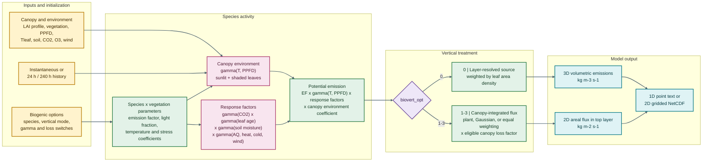
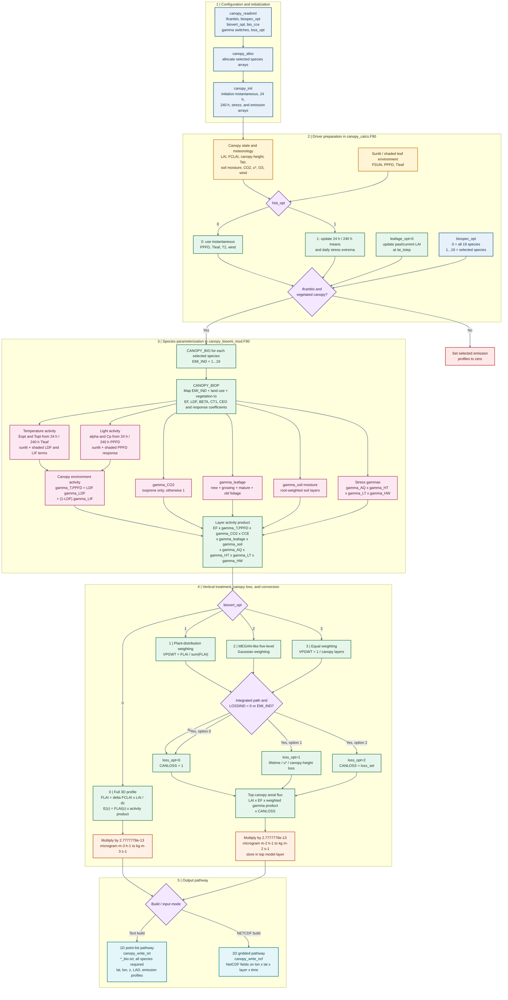

# Parameterizations

The Canopy-App model includes various parameterizations for physical and chemical processes within and above forest canopies. This section provides detailed descriptions of the scientific formulations and parameters used.

## Turbulence Parameterization

### K-Theory Approach

The model uses K-theory to parameterize turbulent transport:

$$
\overline{w'\phi'} = -K_{\phi} \frac{\partial \phi}{\partial z}
$$

where:
- $\overline{w'\phi'}$ is the turbulent flux of scalar $\phi$
- $K_{\phi}$ is the eddy diffusivity for scalar $\phi$
- $z$ is height above ground

### Mixing Length Model

The eddy diffusivity is calculated using a mixing length approach:

$$
K_m = l_m^2 \sqrt{\left(\frac{\partial U}{\partial z}\right)^2 + \left(\frac{\partial V}{\partial z}\right)^2}
$$

$$
K_h = \frac{K_m}{\Pr_t}
$$

where:
- $K_m$ is momentum diffusivity
- $K_h$ is heat/scalar diffusivity
- $l_m$ is mixing length
- $\Pr_t$ is turbulent Prandtl number (typically 0.7-1.3)

### Mixing Length Formulation

Within the canopy, the mixing length is parameterized as:

$$
l_m(z) = \begin{cases}
\beta h \left(\frac{z}{h}\right)^n & \text{for } z < h \\
\kappa z & \text{for } z \geq h
\end{cases}
$$

where:
- $h$ is canopy height
- $\beta$ is scaling parameter (typically 0.1-0.3)
- $n$ is shape parameter (typically 1-3)
- $\kappa$ is von Karman constant (0.41)

## Radiation Parameterization

<!-- ### Two-Stream Approximation

Solar radiation transfer uses the two-stream approximation:

$$
\mu \frac{dI^+}{d\tau} = I^+ - \omega \beta_0 I^+ - \omega \beta_1 I^-
$$

$$
-\mu \frac{dI^-}{d\tau} = I^- - \omega \beta_1 I^+ - \omega \beta_0 I^-
$$

where:
- $I^+, I^-$ are upward and downward radiation intensities
- $\tau$ is optical depth
- $\omega$ is single scattering albedo
- $\beta_0, \beta_1$ are phase function parameters
- $\mu = \cos(\theta)$ for solar zenith angle $\theta$ -->

### Leaf Area Distribution

The cumulative leaf area index from canopy top:

$$
LAI(z) = LAI_{total} \exp\left(-\alpha \left(\frac{h-z}{h}\right)^{\beta}\right)
$$

Parameters:
- $\alpha$: extinction coefficient (typically 0.5-2.0)
- $\beta$: shape parameter (typically 0.5-2.0)

## Biogenic Emissions

### Simplified Parameterization

This compact workflow summarizes the scientific parameterization and principal output
choices for use as a one-page or journal-article figure.

**Figure 1.** Simplified Canopy-App biogenic emissions parameterization. Environmental
activity and species-specific response factors modify the mapped emission factor before
the source is retained as a layer-resolved profile or vertically integrated to a
top-canopy flux.

### Parameterization Workflow

The workflow below follows the implemented path from namelist initialization through
[`canopy_calcs.F90`](../../src/canopy_calcs.F90),
[`canopy_bioemi_mod.F90`](../../src/canopy_bioemi_mod.F90), and the text or NetCDF
writers. Colors group configuration, environmental inputs, activity factors, vertical
treatment, unit conversion, and output.

**Figure 2.** Detailed Canopy-App biogenic emissions implementation workflow. The parameterization is
evaluated independently for each selected species. `biospec_opt=0` evaluates all 19
species; values 1--19 select an individual species.

!!! note "Vertical option and units"
    `biovert_opt=0` retains the layer-resolved source and converts
    $\text{microgram m}^{-3}\text{ h}^{-1}$ to $\text{kg m}^{-3}\text{ s}^{-1}$.
    Options 1--3 vertically integrate the source, apply the eligible canopy loss
    factor, convert $\text{microgram m}^{-2}\text{ h}^{-1}$ to
    $\text{kg m}^{-2}\text{ s}^{-1}$, and place the result in the top model layer.
    Current text and NetCDF variable metadata label biogenic fields as volumetric
    emissions, so users should interpret integrated-option output according to
    `biovert_opt`.

Editable Mermaid sources are available for the
[simplified journal figure](../development/biogenic_emissions_flowchart_simplified.mmd)
and the [detailed implementation flowchart](../development/biogenic_emissions_flowchart.mmd)
for vector export to SVG or PDF.

### Emission Calculation

Following Guenther et al. (2012):

$$
E_i = \epsilon_i \cdot \gamma_{T,P} \cdot \gamma_{CO_2} \cdot C_{CE}
\cdot \gamma_{age} \cdot \gamma_{SM} \cdot \gamma_{AQ}
\cdot \gamma_{HT} \cdot \gamma_{LT} \cdot \gamma_{HW}
$$

where:
- $\epsilon_i$: species- and vegetation-dependent emission factor
- $\gamma_{T,P}$: combined temperature and PPFD activity factor
- $\gamma_{CO_2}$: carbon dioxide inhibition factor for isoprene (unity otherwise)
- $C_{CE}$: canopy environment coefficient (`bio_cce`)
- $\gamma_{age}$: leaf age activity factor
- $\gamma_{SM}$: soil moisture activity factor
- $\gamma_{AQ}$: air-quality stress factor
- $\gamma_{HT}$ and $\gamma_{LT}$: high- and low-temperature stress factors
- $\gamma_{HW}$: high-wind stress factor

### Temperature and Light Dependence

$$
\gamma_{T,P} = C_T \cdot C_L
$$

$$
C_T = \frac{\exp\left(\frac{C_{T1}(T-T_s)}{RT_sT}\right)}{1 + \exp\left(\frac{C_{T2}(T-T_{M})}{RT_sT}\right)}
$$

$$
C_L = \frac{\alpha C_L1 PPFD}{\sqrt{1 + \alpha^2 PPFD^2}}
$$

Parameters:
- $C_{T1} = 95,000$ J/mol
- $C_{T2} = 230,000$ J/mol
- $T_s = 303$ K (standard temperature)
- $T_M = 314$ K (maximum temperature)
- $\alpha = 0.0027$ (empirical coefficient)
- $C_{L1} = 1.066$ (empirical coefficient)

## Dry Deposition

### Resistance Model

Total deposition velocity:

$$
v_d = \frac{1}{r_a + r_b + r_c}
$$

where:
- $r_a$: aerodynamic resistance
- $r_b$: quasi-laminar boundary layer resistance
- $r_c$: canopy resistance

### Canopy Resistance

$$
\frac{1}{r_c} = \frac{1}{r_s + r_m} + \frac{1}{r_{lu}} + \frac{1}{r_{dc}} + \frac{1}{r_{cl}}
$$

where:
- $r_s$: stomatal resistance
- $r_m$: mesophyll resistance
- $r_{lu}$: resistance of upper canopy
- $r_{dc}$: resistance of lower canopy/ground
- $r_{cl}$: resistance of exposed surfaces

## Parameter Tables

### Vegetation-Specific Parameters

| Parameter | Conifer | Deciduous | Grass | Units |
|-----------|---------|-----------|--------|-------|
| $V_{c,max}$ (25°C) | 60 | 80 | 40 | μmol/m²/s |
| $J_{max}$ (25°C) | 120 | 160 | 80 | μmol/m²/s |
| $g_1$ | 3.0 | 4.0 | 5.0 | kPa^0.5 |
| $\epsilon_{iso}$ | 0.1 | 10.0 | 0.0 | μg/g/h |
| $c_d$ | 0.15 | 0.20 | 0.10 | - |

### Temperature Response Parameters

| Parameter | Value | Units | Description |
|-----------|-------|-------|-------------|
| $Q_{10,V}$ | 2.0 | - | $V_{c,max}$ temperature sensitivity |
| $Q_{10,J}$ | 1.9 | - | $J_{max}$ temperature sensitivity |
| $Q_{10,R}$ | 2.0 | - | Respiration temperature sensitivity |
| $H_a$ | 72000 | J/mol | Activation energy |
| $H_d$ | 200000 | J/mol | Deactivation energy |
| $\Delta S$ | 650 | J/mol/K | Entropy term |

### Sensitivity Analysis

Key sensitive parameters identified through sensitivity analysis:

1. **Leaf area index** (±20% → ±15% flux change)
2. **Drag coefficient** (±50% → ±25% wind change)
3. **Maximum carboxylation rate** (±20% → ±18% photosynthesis change)

## References

Key scientific references for parameterizations:

1. **Farquhar et al. (1980)**: Photosynthesis model
2. **Ball et al. (1987)**: Stomatal conductance
3. **Guenther et al. (2012)**: Biogenic emissions
4. **Raupach & Thom (1981)**: Canopy turbulence
5. **Dai et al. (2004)**: Two-stream radiation

For implementation details, see the [API Reference](../api/overview.md).
