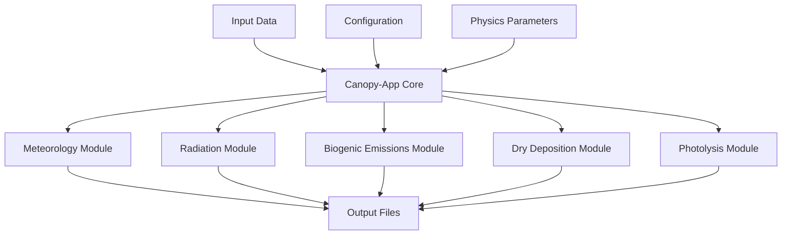

# Model Overview

Welcome to the Canopy-App atmospheric canopy modeling system comprehensive overview.

## Introduction

Canopy-App is a sophisticated one-dimensional model designed to simulate atmospheric processes within and above forest canopies. It was developed to provide detailed representation of:

- **Canopy meteorology** - Wind speed, temperature, and humidity profiles
- **Radiation transfer** - Solar and longwave radiation attenuation
- **Biogenic emissions** - Volatile organic compound (VOC) emissions from vegetation
- **Dry deposition** - Removal of gases and particles by canopy surfaces
- **Photochemical processes** - In-canopy photolysis rate calculations

## Model Architecture



## Key Components

### 1. Canopy Meteorology (`canopy_canmet_mod`)
- Computes wind speed profiles using similarity theory
- Calculates temperature and humidity gradients
- Handles atmospheric stability corrections
- Accounts for canopy drag and momentum absorption

**Key Features:**
- Multi-layer canopy representation
- Stability-dependent mixing lengths
- Canopy influence on turbulence

### 2. Radiation Transfer (`canopy_rad_mod`)
- Solar radiation attenuation through canopy layers
- Longwave radiation exchange
- Photosynthetically active radiation (PAR) calculations
- Solar zenith angle computations

**Key Features:**
- Beer's law attenuation with leaf area density
- Direct and diffuse radiation components
- Seasonal solar angle variations

### 3. Biogenic Emissions (`canopy_bioemi_mod`)
- Temperature-dependent emission rates
- Light-dependent emissions (isoprene)
- Species-specific emission factors
- Canopy-scale flux integration

**Key Features:**
- MEGAN-like algorithms
- Multiple chemical species
- Environmental stress factors

### 4. Dry Deposition (`canopy_drydep_mod`)
- Multi-layer resistance network
- Stomatal and cuticular uptake
- Species-specific deposition velocities
- Environmental controls on deposition

**Key Features:**
- Big-leaf and multi-layer approaches
- Gaseous and particulate (future) deposition
- Season and species dependencies

### 5. Photolysis Rates (`canopy_phot_mod`)
- Attenuation of actinic flux
- Species-specific photolysis rates
- Canopy shading effects
- Solar zenith angle dependencies

**Key Features:**
- Wavelength-dependent calculations
- Multiple photolysis reactions
- Canopy optical properties

## Model Domain

### Vertical Structure

```
    ┌─────────────────┐  ← Above canopy (reference level)
    │                 │
    │   Canopy Top    │  ← z_cantop
    ├─────────────────┤
    │ ║ ║ ║ ║ ║ ║ ║ ║ │  ← Canopy layers (ncanlevs)
    │ ║ ║ ║ ║ ║ ║ ║ ║ │
    │ ║ ║ ║ ║ ║ ║ ║ ║ │
    │ ║ ║ ║ ║ ║ ║ ║ ║ │
    ├─────────────────┤
    │  Canopy Bottom  │  ← z_canbot
    └─────────────────┘  ← Ground level
```

### Spatial Considerations
- **Horizontal**: Point-based calculations (1D vertical column)
- **Vertical**: User-configurable number of canopy layers
- **Temporal**: Instantaneous calculations for given meteorological conditions

## Input Requirements

### Meteorological Data
- Wind speed and direction
- Air temperature
- Relative humidity
- Surface pressure
- Solar radiation components
- Precipitation (optional)

### Canopy Parameters
- Canopy height and structure
- Leaf area index (LAI)
- Plant functional type
- Emission factors (species-specific)
- Phenology information

### Model Configuration
- Physics options and switches
- Numerical parameters
- Output specifications
- Quality control settings

## Output Products

### Standard Variables
- **Meteorology**: Wind, temperature, humidity profiles
- **Radiation**: Solar flux, PAR availability
- **Emissions**: Biogenic VOC fluxes by species
- **Deposition**: Dry deposition velocities and fluxes
- **Photolysis**: J-values for chemical species

### Output Formats
- **NetCDF**: Structured, self-describing format
- **Text**: Human-readable ASCII format
- **Point data**: Time series at specific locations

## Scientific Applications

### Research Applications
- Forest-atmosphere exchange studies
- Air quality modeling input
- Climate change impact assessment
- Ecosystem-atmosphere coupling research

### Operational Applications
- Biogenic emission inventories
- Air quality forecasting
- Environmental impact assessment
- Forest management planning

## Model Strengths

✅ **Physically-based**: Implements well-established scientific algorithms
✅ **Comprehensive**: Covers multiple canopy processes in integrated framework
✅ **Flexible**: Configurable for different forest types and research needs
✅ **Validated**: Based on field measurements and inter-model comparisons
✅ **Efficient**: Optimized Fortran implementation for operational use
✅ **Open Source**: Freely available with complete documentation

## Limitations
⚠️ **Chemical Simplification**: Limited in-canopy chemistry representation

## Model Validation

The model has been validated against:
- Flux tower measurements
- Field campaign data
- Other canopy models
- Laboratory studies

**Key Validation Studies:**
- Forest canopy wind profiles
- Biogenic emission flux measurements

## Next Steps

- 📖 [Learn about input file formats](input-files.md)
- 🏃 [Run your first simulation](running.md)
- 📊 [Understand output files](output-files.md)
- 🔬 [Explore the science documentation](../science/model-description.md)
- 💻 [Browse the API reference](../api/overview.md)
